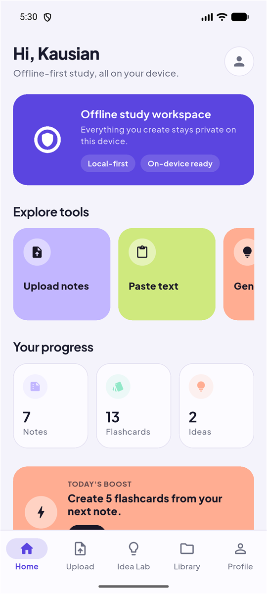
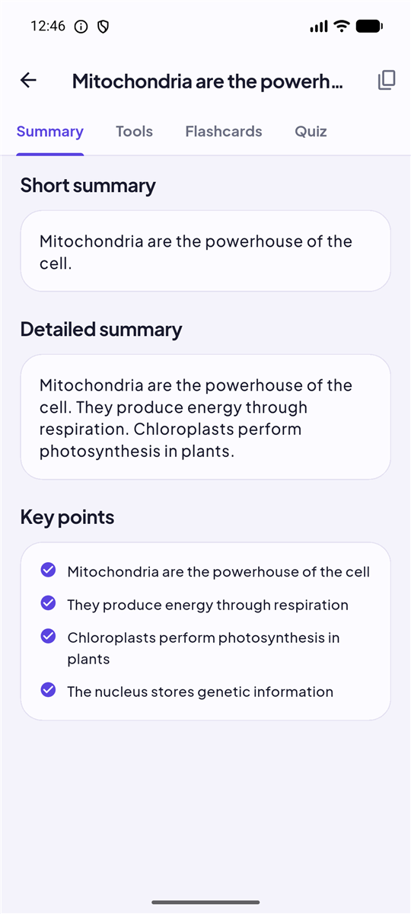
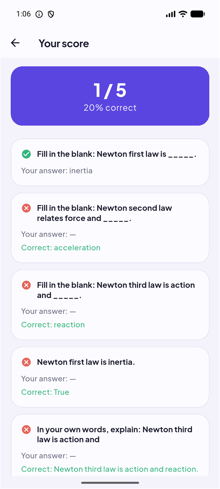
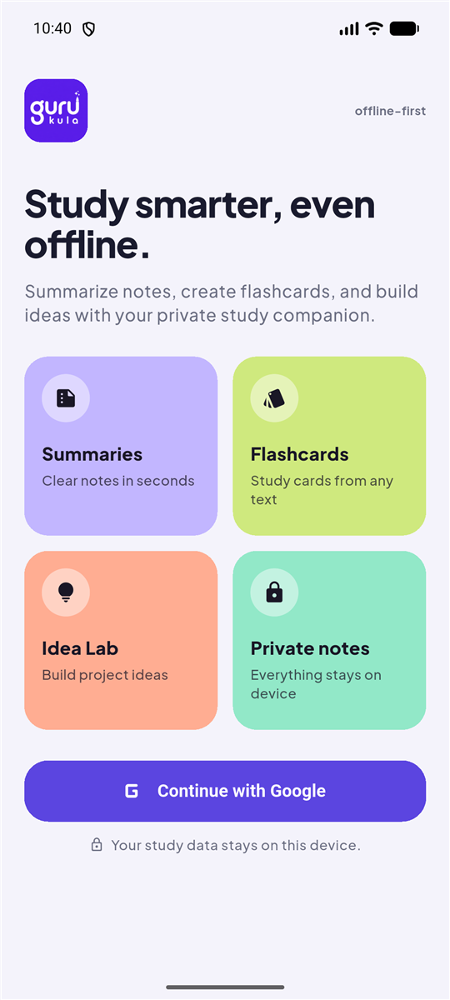
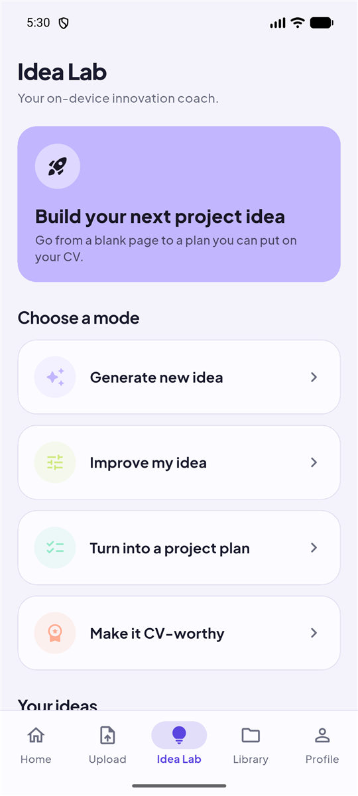
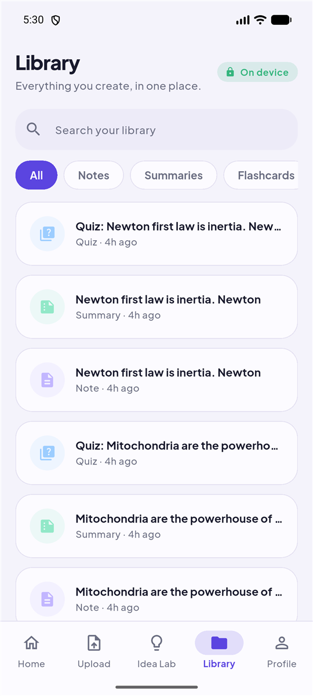
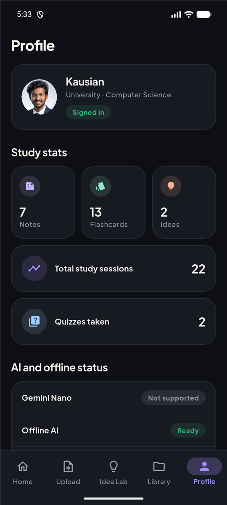

# Gurukula AI

**Your offline AI study companion.** A privacy-first, offline-first study
assistant that helps students summarize notes, make flashcards, take quizzes,
and build project ideas, using **on-device AI** where available and keeping all
study data **local on the device**.


<p>
  
  
  
</p>

## 📲 Download & Install

Gurukula AI is available as an Android APK for early testing.

1. Go to the [GitHub Releases](../../releases) page.

2. Download the latest APK:

   `gurukula-ai-v1.0.0.apk`

3. Open the APK on your Android device.

4. Allow **Install unknown apps** if prompted.

5. Follow the installer instructions.

## The problem

Many students can't fully use AI study tools because they depend on stable
internet, mobile data, paid subscriptions, and cloud processing, and those tools
often send personal study notes to a server. Gurukula flips that: the AI runs
**on the device** (or a local mock when the device can't), and **your notes never
leave your phone**.

## Features

**Study Workspace** (one screen per note)
- Paste lecture notes, then auto-generate a **summary** (short, detailed, key
  points).
- **Tools:** proofread and rewrite text (simpler / formal / shorter).
- **Flashcards:** generate, flip, and mark as reviewed.
- **Quizzes:** generate a mixed quiz (multiple choice, true/false, short
  answer), take it, and get a **score + per-question review**.

**Idea Lab** (a project-idea coach)
- Generate a structured project idea (problem, target users, features, tech
  stack, difficulty, MVP plan, why it is unique).
- Improve an idea, turn it into a project plan, or make it CV-worthy.

**Dashboard & Library**
- Home shows live study progress, a daily challenge, and recent activity.
- Library stores everything locally, filterable by type (notes, summaries,
  flashcards, ideas, quizzes).

**Privacy & profile**
- Google Sign-In for identity only; a local student profile.
- Light / dark / system theme, a privacy notice, and **delete local data**.

## Screenshots

| Welcome | Home | Workspace |
|---|---|---|
|  |  |  |

| Quiz score | Idea Lab | Library | Profile (dark) |
|---|---|---|---|
|  |  |  |  |

## Tech stack

- **Flutter + Dart** — app UI (Material 3, light/dark, custom design system).
- **Kotlin + Flutter MethodChannel** — native bridge for on-device AI.
- **Riverpod** — state management; **go_router** — navigation + auth gate.
- **Hive CE** — local-only database for all study data.
- **Firebase Authentication** — Google Sign-In (identity only).
- **ML Kit GenAI / Gemini Nano (AICore)** — on-device AI, with a deterministic
  **mock fallback**.

## Architecture

```
Flutter UI → Riverpod providers → domain services → repositories → Hive boxes
                                      │
                                      └─ AiService ─┬─ MockAiService (offline fallback)
                                                    └─ OnDeviceAiService ── MethodChannel
                                                                           → Kotlin GenAiBridge
                                                                           → ML Kit GenAI / Gemini Nano
```

The whole app codes against one `AiService` interface, so the real on-device
implementation and the mock are interchangeable. Full details in
[docs/architecture.md](docs/architecture.md) and the journey in
[docs/user-flow.md](docs/user-flow.md).

## Local-first privacy

- **Study data stays on the device** (Hive). Documents, summaries, flashcards,
  rewrites, ideas, quizzes and activity are never uploaded.
- **Firebase is identity-only:** no Firestore, Storage, or Functions.
- **No cloud AI:** summaries/rewrites run on-device (Gemini Nano) or via the
  local mock. No Gemini Cloud API, no OpenAI.

## On-device AI (Gemini Nano) bridge

`OnDeviceAiService` calls a Kotlin `GenAiBridge` over the `gurukula/ai`
MethodChannel, which targets **ML Kit GenAI running on Gemini Nano via AICore**.
Every call is **defensive**: if the device doesn't support on-device AI (most
phones, and all standard emulators), it transparently falls back to the
`MockAiService`, so the full study flow always works.

> On an emulator the Profile shows **"Not supported"** and everything runs
> through the mock, which is expected. On a supported device (e.g. Pixel 8+/9,
> Galaxy S24+) summaries/rewrites/proofreading upgrade to real on-device
> inference with no Dart changes. See the TODOs in `GenAiBridge.kt`.

## Zero-cost

No backend, no paid APIs, no billing account. Firebase Auth + Google Sign-In are
free (Spark plan); AI is on-device or mock; Hive is local. Details in
[docs/zero-cost-plan.md](docs/zero-cost-plan.md).

## Getting started

### Prerequisites
- Flutter SDK (3.x) and an Android device/emulator (API 23+).

### 1. Install
```bash
git clone https://github.com/Kausian/gurukula-ai.git
cd gurukula-ai
flutter pub get
```

### 2. Firebase (Google Sign-In)
Google Sign-In needs a Firebase project. Follow
[docs/firebase-setup.md](docs/firebase-setup.md) to create the project, add the
Android app (`com.gurukula.gurukula_ai`), register your debug SHA-1/SHA-256, and
generate `google-services.json` + `lib/firebase_options.dart` (both git-ignored).

### 3. Run
```bash
flutter run --dart-define=GOOGLE_SERVER_CLIENT_ID=YOUR_WEB_CLIENT_ID.apps.googleusercontent.com
```
The `GOOGLE_SERVER_CLIENT_ID` is the Firebase **Web client ID** (see the setup
doc). On the emulator, sign into a Google account once so the picker has an
account.

## Demo flow

1. Continue with Google → create your profile → Home.
2. **Upload → Paste text** → "Create study workspace" → a summary appears.
3. In the workspace: generate **flashcards**, rewrite text in **Tools**, then
   open **Quiz**, generate, take it, and see your score.
4. **Idea Lab** → Generate a project idea → Save → Improve / Project plan /
   Make CV-worthy.
5. **Library** shows everything; **Home/Profile** stats update live.
6. **Profile** → switch theme, or delete local data, or sign out.

## Project structure

```
lib/
├── app/         app root, router (auth gate), theme
├── core/        constants, utils, reusable widgets
├── data/        Hive models + adapters, repositories, providers
├── features/    auth, onboarding, home, upload, study, idea_lab, library,
│                profile, settings, shell
└── services/    AiService, MockAiService, OnDeviceAiService, AuthService
android/app/src/main/kotlin/.../GenAiBridge.kt   # on-device AI bridge
docs/            architecture, user-flow, zero-cost, firebase-setup, screenshots
```
