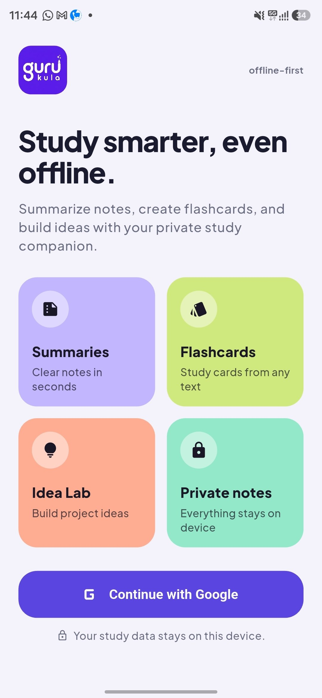
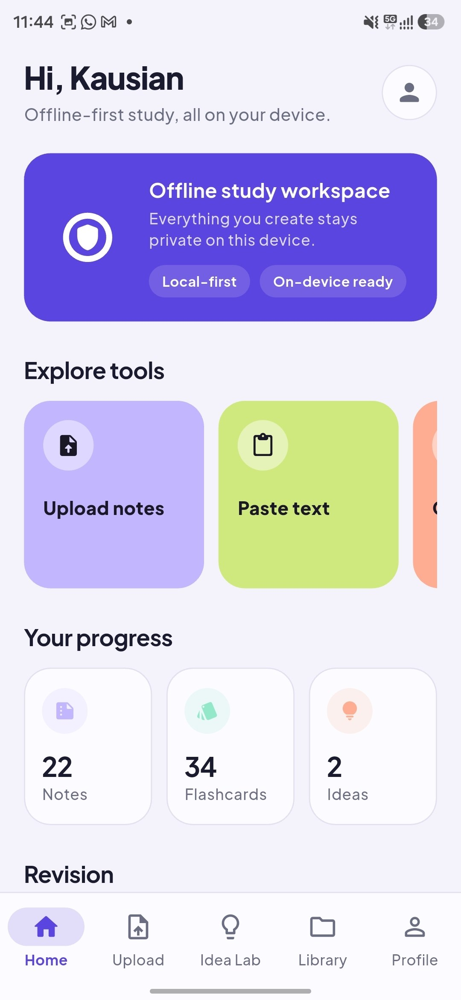
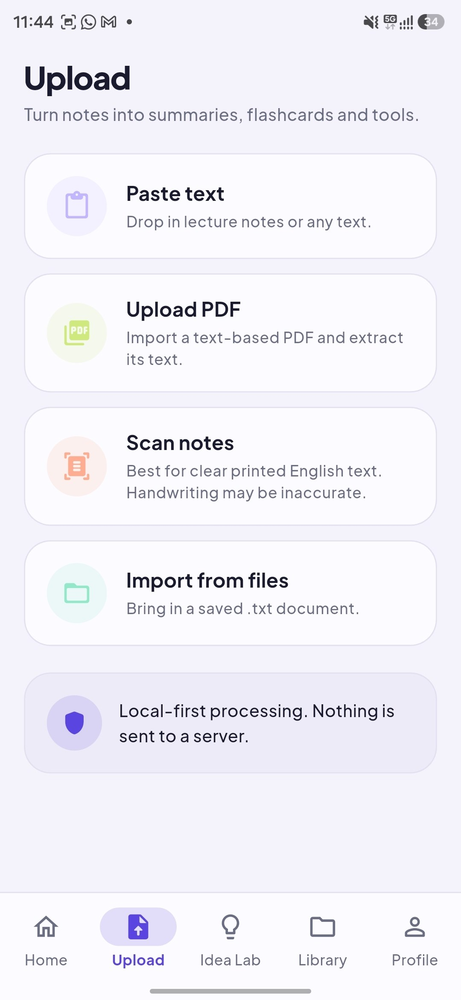
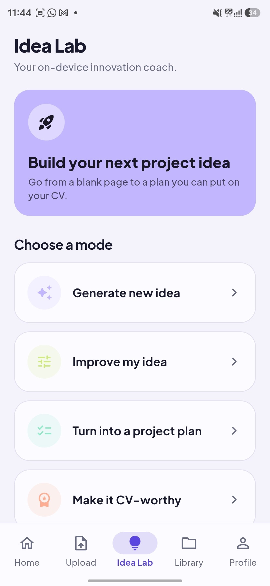
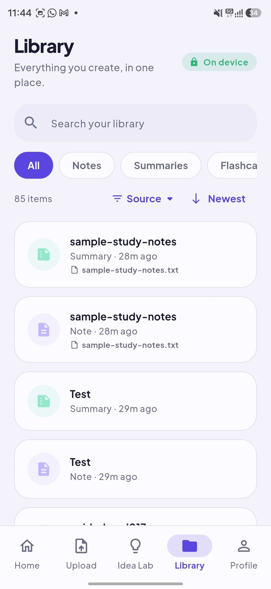
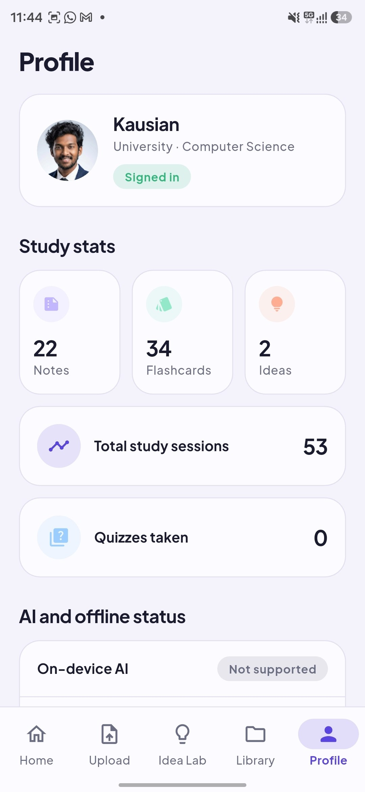
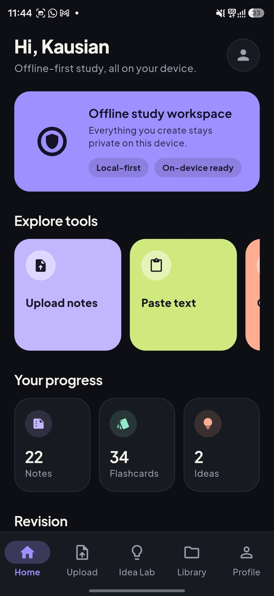
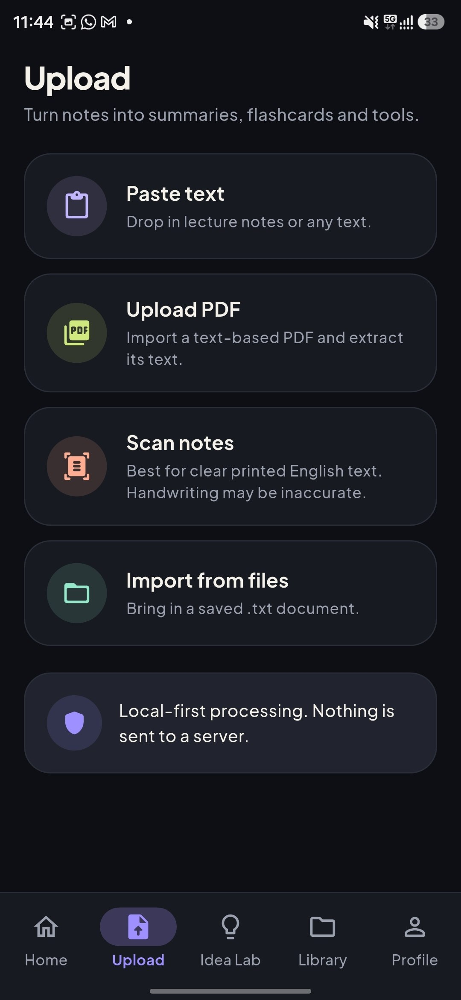
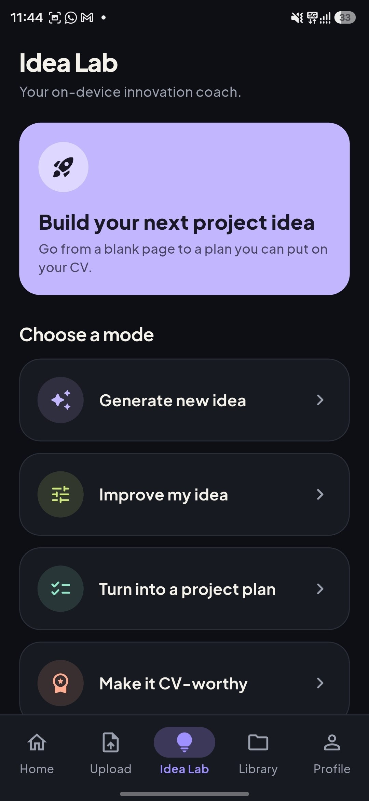
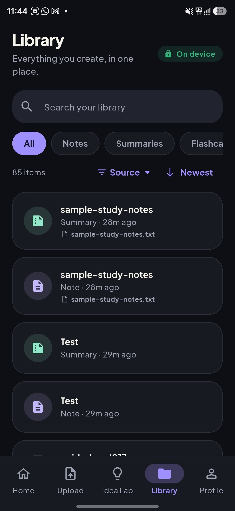

<div align="center">
  
  <br/>
  

  <h1>Gurukula AI</h1>

  <p><strong>Study smarter, even when the internet does not help.</strong></p>

  <p>A privacy-first, offline-focused study assistant app for students.</p>

  <p>
    
    
    
    
    
    
    
  </p>
</div>

---

## 📖 Overview

**Gurukula AI** helps students study, revise, and build ideas even with **limited internet, privacy concerns, or no access to paid AI tools**. It turns your notes, `.txt` files, text-based PDFs, and photos of printed notes into **summaries, flashcards, quizzes, and project ideas** — and keeps everything **on your device**.

It is built **offline-first**: the full study workflow works without a network connection. Where the device supports it, Gurukula AI uses **on-device AI (ML Kit GenAI / Gemini Nano)** for real summary generation, and it falls back to a safe built-in generator everywhere else — so the app stays fully usable on **every** supported Android device.

> ⚠️ **Honest by design:** Gurukula AI does **not** require Gemini Nano. It *uses ML Kit GenAI / Gemini Nano where supported, with a safe fallback mode for unsupported devices.* No OpenAI API and no cloud Gemini API are used.

---

## 📱 Screenshots

### ☀️ Light mode

| Login | Home | Upload |
|---|---|---|
|  |  |  |

| Idea Lab | Library | Profile |
|---|---|---|
|  |  |  |

### 🌙 Dark mode

| Dark Home | Dark Upload |
|---|---|
|  |  |

| Dark Idea Lab | Dark Profile |
|---|---|
|  |  |

---

## ✨ Key features

| Area | What you get |
|------|--------------|
| **Capture notes** | Paste text · import `.txt` · import text-based PDFs |
| **Scan notes (OCR)** | Pick an image from the gallery or take a photo, extract text on-device |
| **Summaries** | Short summary, detailed summary, and key points |
| **Real on-device AI** | On-device summary generation where ML Kit GenAI / Gemini Nano is available |
| **Safe fallback** | A built-in generator produces summaries on unsupported devices |
| **Source transparency** | Each summary shows a badge: **On-device AI** or **Fallback mode** |
| **Study tools** | Flashcards · quizzes · revision mode · smart spaced practice |
| **Idea Lab** | Generate, refine, and plan project ideas locally |
| **Library** | Search, filter, sort, and open everything you've created |
| **Share & export** | Copy, share, and export study content as `.txt` |
| **Account** | Google Sign-In (identity only) · dynamic app version · feedback/contact option |
| **Polish** | Light & dark mode · overflow-safe, font-scaling-friendly UI |

---

## ⚙️ How it works

1. **Add material** — paste text, import a `.txt`/PDF, pick a gallery image, or scan a page with the camera.
2. **Extract text** — text files and PDFs are read directly; images run through **on-device OCR** (ML Kit Text Recognition).
3. **Review & edit** — a preview screen lets you clean up the extracted text before saving.
4. **Create a study workspace** — Gurukula AI generates a **summary** (on-device AI where available, fallback otherwise), then flashcards and a quiz on demand.
5. **Revise** — practice flashcards, take quizzes, and let **smart spaced practice** schedule what's due.
6. **Organize & share** — find anything in the **Library**, and copy / share / export to `.txt`.

Everything is stored **locally**. Nothing is uploaded to a server.

---

## 🧱 Tech stack

| Layer | Technology |
|-------|------------|
| **App** | Flutter · Dart |
| **State management** | Riverpod |
| **Local storage** | Hive (local-first, single source of truth) |
| **Auth** | Firebase Auth · Google Sign-In (identity only) |
| **Native bridge** | Kotlin · `MethodChannel` |
| **OCR** | ML Kit Text Recognition (on-device, Latin script) |
| **On-device GenAI** | ML Kit GenAI / Gemini Nano / Android AICore *(where supported)* |
| **Architecture** | Local-first, offline-focused, fallback-safe |

---

## 🏛️ Architecture overview

```
Flutter UI (Riverpod)
        │
        ▼
  Study controllers / providers
        │
        ├──► Hive repositories ──► Local device storage (all study data)
        │
        └──► AiService (interface)
                 ├── OnDeviceAiService ──(Kotlin MethodChannel)──► ML Kit GenAI / Gemini Nano
                 │         └── falls back automatically on any failure
                 └── MockAiService ─────────────────────────────► safe built-in fallback
```

- **One `AiService` interface, two implementations.** The on-device service tries real ML Kit GenAI; if the device is unsupported, the model isn't ready, or anything errors or times out, it **transparently falls back** to the built-in generator.
- **Hive is the single source of truth** for notes, summaries, flashcards, quizzes, ideas, and revision data.
- **Firebase is used only for identity** (Google Sign-In) — no study data is sent anywhere.

---

## 🔒 Privacy-first design

- 🗂️ **Your study data stays on your device**, stored locally with **Hive**.
- 🚫 **No cloud sync, no backend, no analytics of your notes.**
- 🤖 **No OpenAI API and no cloud Gemini API.** AI runs **on-device** where supported.
- 🖼️ **OCR is on-device** — images are processed locally and never uploaded.
- 🔑 **Google Sign-In is identity only**; it does not store or read your study content.

---

## 🧠 On-device AI explanation

Gurukula AI is **ready** for on-device generative AI but never **depends** on it:

- ✅ **Available** → real **on-device summary generation** via **ML Kit GenAI / Gemini Nano**, and the summary is tagged **“Generated by On-device AI.”**
- 🟡 **Preparing / downloadable** → uses **fallback mode** and tells you the model isn't ready yet.
- ⚪ **Not supported** → uses **fallback mode**; the app remains fully usable.

**Important honesty notes:**
- Real on-device summary generation works **only where the device supports** ML Kit GenAI / Gemini Nano (e.g. select recent high-end Android devices with AICore).
- **Fallback mode remains active** as the safety net on every other device, and for flashcards, quizzes, ideas, and rewrites.
- This phase wires **summary generation** to on-device AI; other features currently use the built-in generator.

---

## 🔤 OCR limitations

- ✅ **Works best with clear, printed/typed English text.**
- ✍️ **Handwriting may be inaccurate** — messy notebook photos can produce poor results.
- 🌐 **Sinhala and Tamil OCR are not supported yet.**
- 📶 On some Android devices, the OCR model setup may need Google Play Services **once**.

---

## 📥 APK installation guide

> Android only.

1. Build a release APK:
   ```bash
   flutter build apk --release
   ```
   The APK is written to `build/app/outputs/flutter-apk/app-release.apk`.
2. Transfer the APK to your Android phone.
3. On the phone, allow **“Install unknown apps”** for your file manager / browser.
4. Open the APK and install.
5. **Minimum Android version: API 26 (Android 8.0)** — required after the ML Kit GenAI integration.

> Building from source requires the Flutter SDK, an Android toolchain, and a Firebase `google-services.json` for Google Sign-In.

---

## 🚧 Current limitations

- On-device AI generation currently covers **summaries only**; flashcards, quizzes, ideas, and rewrites use the built-in fallback generator.
- Real on-device AI is **device-dependent** — most devices will run in **fallback mode**.
- **OCR is English / Latin-script and printed-text focused**; handwriting and Sinhala/Tamil are not supported yet.
- **Android only** (no iOS build configured).
- **Minimum Android SDK is API 26.**

---

## 🗺️ Roadmap

- [ ] Extend on-device generation to **flashcards** and **quizzes**
- [ ] Optional, user-initiated **on-device model download**
- [ ] Improved OCR guidance and image pre-processing
- [ ] Additional export formats
- [ ] Broader language support (future)

---

## 📌 Project status

**Active.** Current version: **v1.15.0**. The core study workflow, OCR, real on-device summary availability, and on-device summary generation (with fallback) are implemented and verified on-device.

---

## 👨‍💻 Developer

Built by **Kausian** as a real, problem-solving study app for students — not just a demo.

- **GitHub:** [github.com/Kausian/gurukula-ai](https://github.com/Kausian/gurukula-ai)
- **Feedback / contact:** in-app **“Send feedback”** option (Profile → Settings)

---

## License

This project is currently maintained as a personal portfolio project.  
License details will be added later.
